# Nexus 100% Roadmap: Visual Diagrams

## System Architecture for 100% Production Readiness

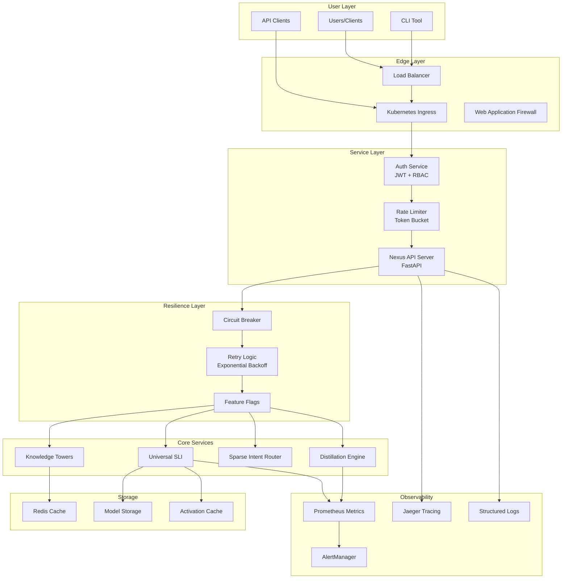

## Implementation Timeline

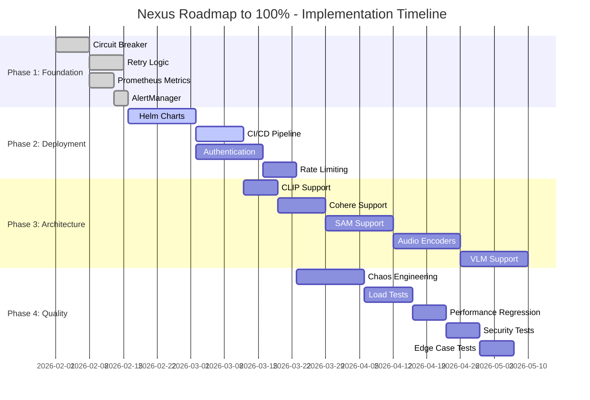

## Metric Progression

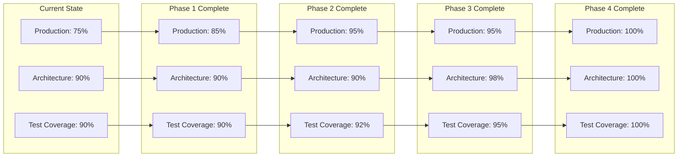

## Test Coverage Breakdown

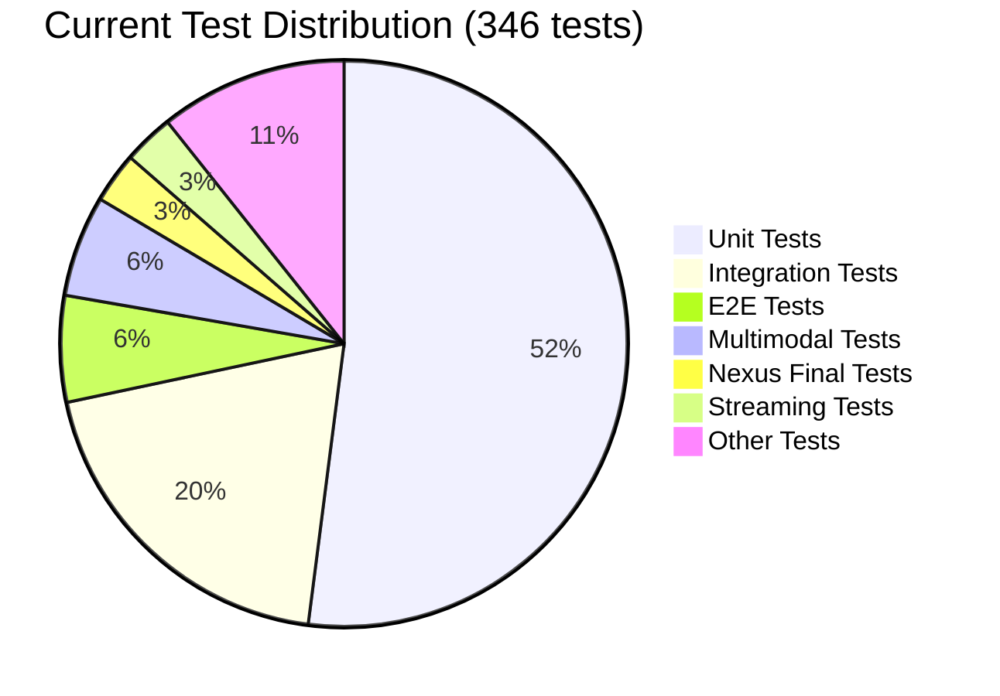

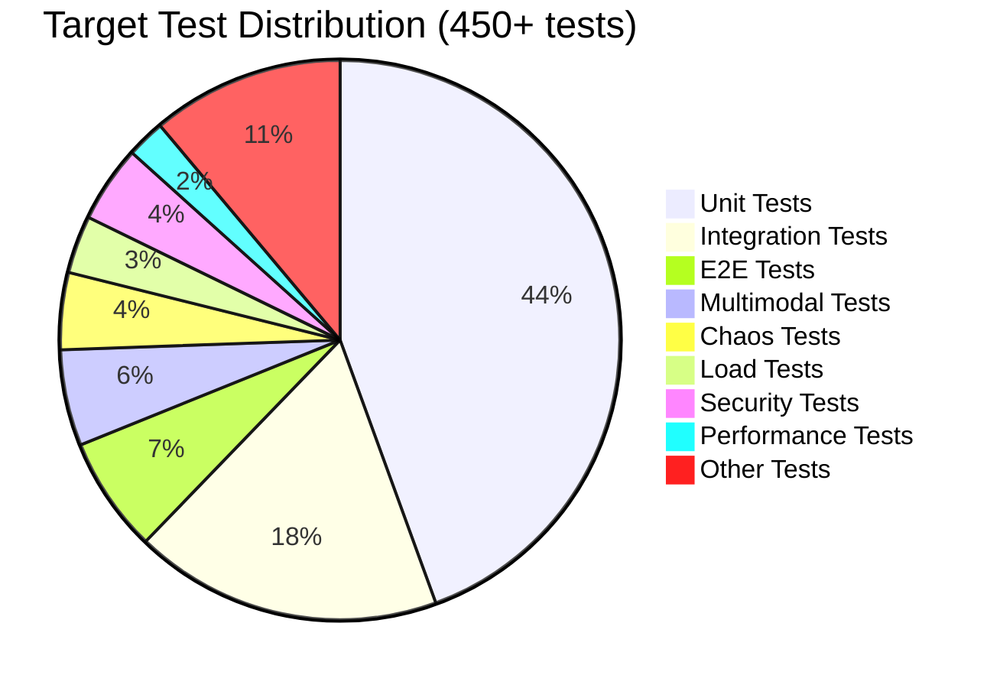

## Priority Matrix

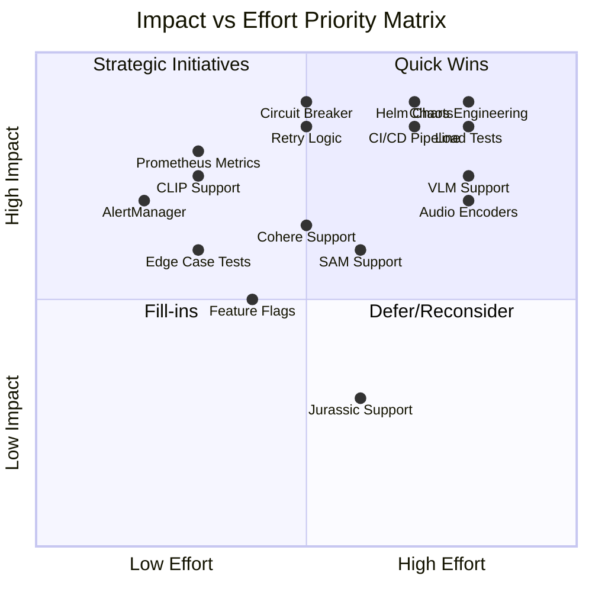

## Architecture Support Expansion

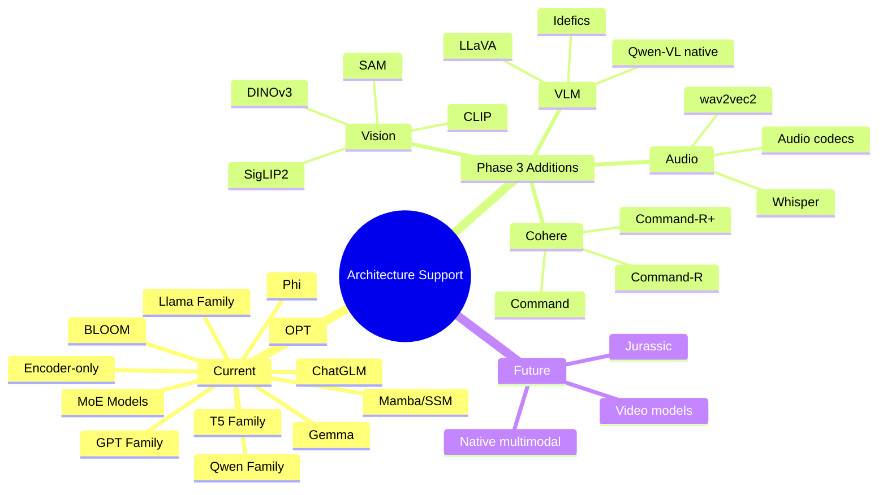

## Deployment Architecture

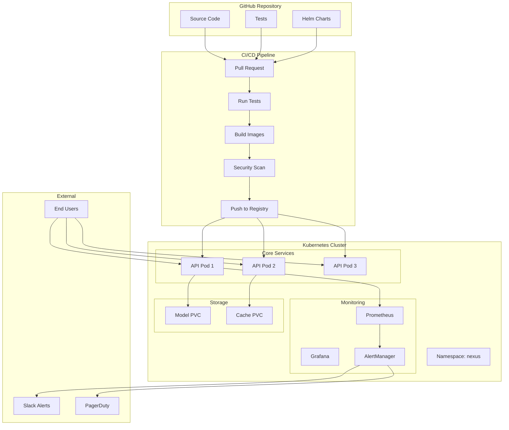

## Storage & I/O Efficiency Explained

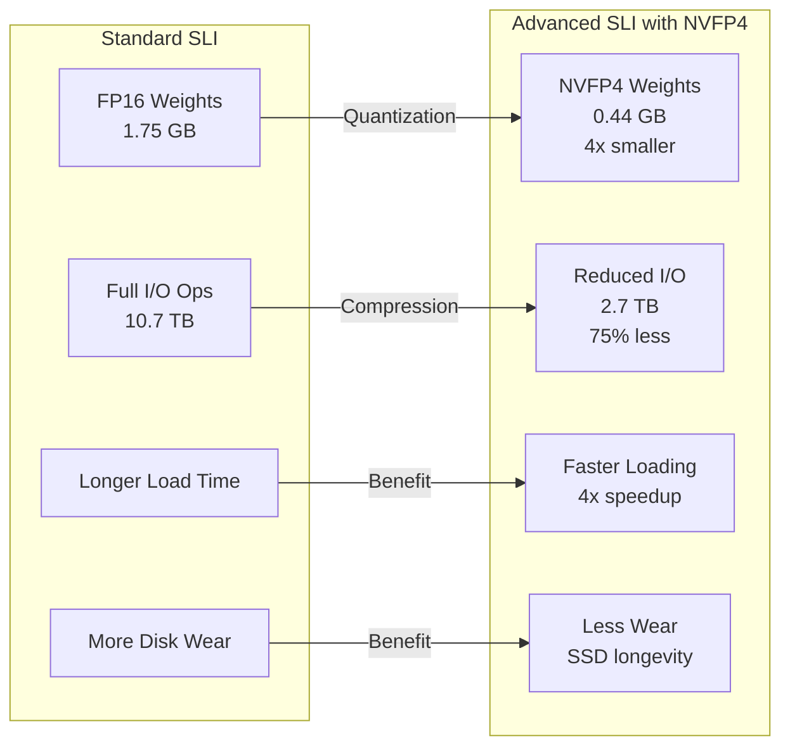

## Circuit Breaker State Machine

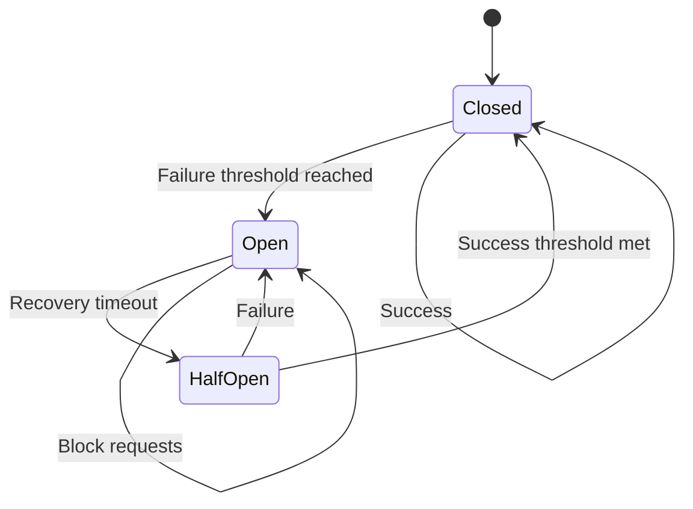

## Complete Task Dependency Graph

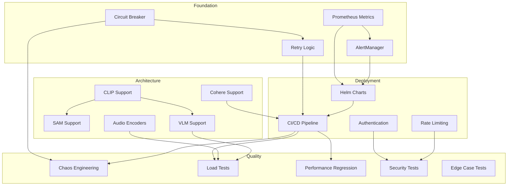

---

*Diagrams support the Roadmap to 100% implementation plan*
